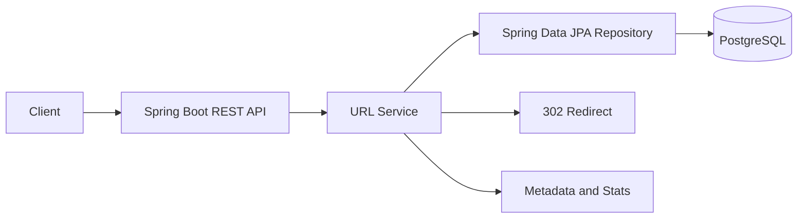
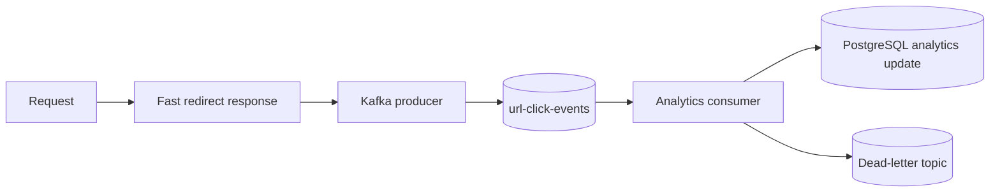

# Distributed URL Shortener

A production-minded URL shortener backend built as a focused MVP with Java 21, Spring Boot, PostgreSQL, Spring Data JPA, Flyway, Bean Validation, and Actuator.

This version intentionally implements the durable database-backed core first. Redis caching and Kafka analytics are documented as the next integration milestone so the code remains easy to study and explain in an interview.

## Features

- Create short URLs with optional expiration
- Redirect short codes with HTTP `302 Found`
- Retrieve URL metadata
- Soft-delete URLs without losing their history
- Track click count and last access time
- Validate HTTP and HTTPS target URLs
- Generate collision-resistant short codes from database-generated IDs
- Version database schema with Flyway
- Expose health and metrics through Spring Boot Actuator
- Centralize API validation and error responses

## Architecture



The controller handles HTTP concerns. The service owns validation, expiration, activation, and short-code behavior. The repository owns persistence. PostgreSQL is the system of record.

## Request Flow

### Create

1. The client sends an HTTP(S) URL and optional future expiration time.
2. The service validates the request.
3. PostgreSQL generates a unique numeric ID.
4. The ID is encoded using Base62.
5. The short code is stored with a unique constraint.
6. The API returns the short URL and metadata.

### Redirect

1. The service looks up the short code in PostgreSQL.
2. It rejects missing, inactive, or expired URLs with `404 Not Found`.
3. It atomically increments the click count and records the access time.
4. It returns `302 Found` with the original URL in the `Location` header.

Expiration prevents redirecting but metadata and historical statistics remain readable.

## Database Design

The `urls` table contains:

| Column | Purpose |
| --- | --- |
| `id` | PostgreSQL-generated identity used as the uniqueness source |
| `short_code` | Base62 representation of `id`; unique and indexed |
| `original_url` | Validated HTTP(S) destination |
| `created_at` | Creation timestamp in UTC |
| `expires_at` | Optional expiration timestamp |
| `click_count` | Basic click total |
| `last_accessed_at` | Most recent redirect timestamp |
| `active` | Soft-delete flag |
| `version` | JPA optimistic-locking field |

The unique constraint guarantees that two records cannot share a short code. The index makes redirect lookup efficient. PostgreSQL identity generation makes concurrent creation safe without coordinating application servers.

## API

### Create a URL

```http
POST /api/v1/urls
Content-Type: application/json

{
  "originalUrl": "https://example.com/some/long/url",
  "expiresAt": "2027-01-01T00:00:00Z"
}
```

Response: `201 Created`

```json
{
  "shortCode": "1",
  "shortUrl": "http://localhost:8080/1",
  "originalUrl": "https://example.com/some/long/url",
  "createdAt": "2026-09-11T12:00:00Z",
  "expiresAt": "2027-01-01T00:00:00Z"
}
```

### Redirect

```http
GET /1
```

Returns `302 Found` with a `Location` header.

### Metadata

```http
GET /api/v1/urls/1
```

### Delete

```http
DELETE /api/v1/urls/1
```

Returns `204 No Content`. The row is deactivated rather than physically removed.

### Statistics

```http
GET /api/v1/urls/1/stats
```

```json
{
  "shortCode": "1",
  "totalClicks": 12,
  "createdAt": "2026-09-11T12:00:00Z",
  "lastAccessedAt": "2026-09-11T12:10:00Z"
}
```

## Local Setup

Requirements:

- Java 21
- Docker
- Maven Wrapper

Start PostgreSQL:

```bash
docker compose up -d postgres
```

Set configuration using environment variables or `.env.example` values:

```bash
export DATABASE_URL=jdbc:postgresql://localhost:55432/urlshortener
export DATABASE_USERNAME=urlshortener
export DATABASE_PASSWORD=change-me
export BASE_URL=http://localhost:8080
```

Run the application:

```bash
./mvnw spring-boot:run
```

The service starts on `http://localhost:8080`. Flyway applies the schema migration automatically.

## Docker

The current Compose file provides PostgreSQL for the MVP:

```bash
docker compose up -d postgres
```

The application can be containerized in the next milestone. Redis and Kafka are deliberately not started by this MVP because no application code depends on them yet.

## Testing

```bash
./mvnw test
./mvnw package
```

The test suite includes Base62 encoding, URL validation, expiration, redirect behavior, atomic click recording, and controller redirect behavior.

## Redis Extension

The next distributed slice should add a cache-aside adapter:

1. Look up `shortCode -> originalUrl` in Redis.
2. On a miss, query PostgreSQL.
3. Cache the result with a TTL bounded by the URL expiration time.
4. Fall back to PostgreSQL if Redis is unavailable.
5. Evict the key when a URL is deactivated.

Redis must improve latency without becoming a correctness dependency. A Redis outage should increase database traffic, not break redirects.

## Kafka Extension

Click analytics should move off the redirect path:



The event should contain the short code, event timestamp, request ID, and carefully selected user-agent data. Raw IP storage should be avoided unless there is a clear privacy and retention policy. Retries and a dead-letter topic handle processing failures. Analytics are eventually consistent and may require idempotency keys for duplicate delivery.

## Scaling Discussion

### 1,000 requests/second

- Run multiple stateless application instances behind a load balancer.
- Keep PostgreSQL as the source of truth.
- Add Redis for common redirect lookups.
- Publish click events asynchronously.
- Add rate limiting at the edge or API gateway.

### 10,000 requests/second

- Scale application instances horizontally.
- Use Redis replicas or Redis Cluster.
- Use PostgreSQL read replicas for metadata and redirect reads.
- Partition Kafka topics so consumers can scale independently.
- Monitor cache hit rate, database latency, connection pools, and hot keys.
- Apply backpressure and bounded retries to analytics.

### 100,000+ requests/second

- Partition or shard the URL store by a stable hash of the short code.
- Use globally distributed caching and consider regional traffic routing.
- Separate redirect storage from analytics storage.
- Protect hot URLs with replication and request coalescing.
- Use Kafka partitions sized for the expected event volume.
- Accept eventual consistency for click statistics while preserving strong uniqueness and redirect correctness.

The main availability trade-off is that cached redirects can remain available during a database read outage, but cache invalidation and expiration become harder. The MVP chooses correctness and simple recovery first.

## Failure Scenarios

- **PostgreSQL unavailable:** creation and uncached reads fail; the application should expose an unhealthy readiness state.
- **Redis unavailable:** future cache implementation falls back to PostgreSQL.
- **Kafka unavailable:** redirect responses continue; click publication is retried or sent to a local failure mechanism.
- **Expired URL:** redirect returns `404`; metadata and statistics remain available.
- **Concurrent creation:** database-generated IDs and the unique short-code constraint prevent duplicate codes.
- **Concurrent redirects:** the atomic update query avoids lost click increments.

## Design Trade-offs

- `302` is used instead of `301` so clients and browsers do not permanently cache redirects while the product is evolving.
- Base62 encoding a database ID is simple and guarantees uniqueness without random collision retries. It does expose creation order, which can be addressed later with an opaque ID strategy if needed.
- Soft deletion preserves analytics and makes accidental recovery possible, but requires every redirect query to check active state.
- PostgreSQL is sufficient for the MVP; sharding and replicas are future scaling tools rather than premature complexity.

## Limitations and Future Improvements

- Redis caching is not implemented yet.
- Kafka event publishing and asynchronous analytics are not implemented yet.
- Authentication, authorization, per-user ownership, abuse detection, and distributed rate limiting are future work.
- The MVP has basic click analytics rather than time-series or geographic analytics.
- Production deployment would need secrets management, TLS, migrations in CI/CD, dashboards, alerting, and backup/restore procedures.

## Interview Study Topics

Be prepared to explain:

1. Why PostgreSQL is the source of truth.
2. Why a database-generated ID plus Base62 avoids collisions.
3. How unique constraints protect correctness under concurrency.
4. Why redirects should not wait for Kafka analytics.
5. How cache-aside Redis behaves during cache misses and outages.
6. Why click counts use an atomic database update.
7. What changes between 1k, 10k, and 100k requests per second.
8. Where the design chooses consistency over availability and where it accepts eventual consistency.
9. How authentication and abuse prevention would be added for a public service.
10. How expiration, deletion, retention, and privacy affect the data model.
